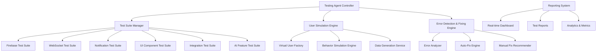

# Design Document

## Overview

The Comprehensive Testing Agent is an intelligent, automated testing system designed to validate all features of the GoCars taxi booking platform. It simulates real user behavior, performs end-to-end testing, identifies issues, and provides automated fixes where possible. The system is built as a modular, extensible framework that can adapt to new features and testing requirements.

## Architecture

### High-Level Architecture



### Core Components

#### 1. Testing Agent Controller
- **Purpose**: Central orchestrator that manages all testing operations
- **Responsibilities**:
  - Initialize and coordinate test suites
  - Manage test execution flow
  - Handle concurrent testing scenarios
  - Provide unified API for external interactions

#### 2. Test Suite Manager
- **Purpose**: Manages individual test suites and their execution
- **Responsibilities**:
  - Load and configure test suites
  - Execute tests in proper sequence
  - Handle dependencies between test suites
  - Collect and aggregate results

#### 3. User Simulation Engine
- **Purpose**: Creates realistic user interactions and behaviors
- **Responsibilities**:
  - Generate virtual users with different profiles
  - Simulate realistic user journeys
  - Handle concurrent user scenarios
  - Maintain session state and context

#### 4. Error Detection & Fixing Engine
- **Purpose**: Identifies issues and provides automated solutions
- **Responsibilities**:
  - Analyze test failures and errors
  - Categorize issues by severity and type
  - Apply automated fixes for known issues
  - Generate recommendations for complex problems

## Components and Interfaces

### Test Suite Architecture

Each test suite follows a standardized interface:

```typescript
interface TestSuite {
  id: string
  name: string
  description: string
  dependencies: string[]
  setup(): Promise<void>
  teardown(): Promise<void>
  runTests(): Promise<TestResult[]>
  getHealthStatus(): HealthStatus
}

interface TestResult {
  id: string
  name: string
  status: 'passed' | 'failed' | 'skipped' | 'error'
  duration: number
  message?: string
  details?: any
  screenshots?: string[]
  logs?: string[]
}
```

### Firebase Test Suite

**Components**:
- Authentication Tester
- Firestore Operations Tester
- Cloud Functions Tester
- Storage Tester
- Security Rules Tester

**Key Tests**:
- User registration and login flows
- Database CRUD operations
- Real-time listener functionality
- File upload/download operations
- Security rule validation

### WebSocket Test Suite

**Components**:
- Connection Manager Tester
- Real-time Messaging Tester
- Room Management Tester
- Reconnection Logic Tester
- Performance Tester

**Key Tests**:
- Connection establishment and authentication
- Message delivery and ordering
- Room joining/leaving functionality
- Automatic reconnection scenarios
- Load testing with multiple concurrent connections

### Notification Test Suite

**Components**:
- FCM Integration Tester
- Template System Tester
- Intelligent Management Tester
- Delivery Analytics Tester
- User Preferences Tester

**Key Tests**:
- Push notification delivery
- Template rendering and personalization
- Smart batching and grouping
- Do-not-disturb functionality
- Engagement tracking and analytics

### UI Component Test Suite

**Components**:
- Component Renderer Tester
- Interaction Tester
- Accessibility Tester
- Responsive Design Tester
- Performance Tester

**Key Tests**:
- Component rendering across browsers
- User interaction simulation
- Accessibility compliance (WCAG)
- Mobile responsiveness
- Load time and performance metrics

### Integration Test Suite

**Components**:
- End-to-End Flow Tester
- API Integration Tester
- Third-party Service Tester
- Data Consistency Tester
- Business Logic Tester

**Key Tests**:
- Complete booking workflows
- Payment processing flows
- Driver-passenger matching
- Real-time tracking accuracy
- Emergency alert systems

### AI Feature Test Suite

**Components**:
- Model Response Tester
- Recommendation Engine Tester
- Natural Language Processing Tester
- Predictive Analytics Tester
- Performance Benchmarker

**Key Tests**:
- AI model accuracy and response quality
- Recommendation relevance and personalization
- Text analysis and sentiment detection
- Prediction accuracy validation
- Response time and resource usage

## Data Models

### Test Configuration

```typescript
interface TestConfiguration {
  id: string
  name: string
  environment: 'development' | 'staging' | 'production'
  testSuites: string[]
  userProfiles: UserProfile[]
  concurrencyLevel: number
  timeout: number
  retryAttempts: number
  reportingOptions: ReportingOptions
  autoFixEnabled: boolean
  notificationSettings: NotificationSettings
}

interface UserProfile {
  id: string
  role: 'passenger' | 'driver' | 'operator' | 'admin'
  demographics: {
    age: number
    location: string
    deviceType: 'mobile' | 'desktop' | 'tablet'
    experience: 'new' | 'regular' | 'power'
  }
  preferences: {
    paymentMethod: string
    notificationSettings: any
    language: string
  }
  behaviorPatterns: {
    bookingFrequency: number
    averageRideDistance: number
    preferredTimes: string[]
    cancellationRate: number
  }
}
```

### Test Execution Context

```typescript
interface TestExecutionContext {
  sessionId: string
  startTime: Date
  configuration: TestConfiguration
  virtualUsers: Map<string, VirtualUser>
  testResults: Map<string, TestResult[]>
  systemState: SystemState
  errorLog: ErrorEntry[]
  performanceMetrics: PerformanceMetrics
}

interface VirtualUser {
  id: string
  profile: UserProfile
  session: UserSession
  currentState: UserState
  actionHistory: UserAction[]
}
```

### Error Classification

```typescript
interface ErrorEntry {
  id: string
  timestamp: Date
  severity: 'low' | 'medium' | 'high' | 'critical'
  category: 'functional' | 'performance' | 'security' | 'usability' | 'integration'
  component: string
  description: string
  stackTrace?: string
  context: any
  autoFixable: boolean
  fixApplied?: boolean
  fixDetails?: string
}
```

## Error Handling

### Error Detection Strategy

1. **Automated Monitoring**:
   - Real-time error detection during test execution
   - Performance threshold monitoring
   - Resource usage tracking
   - Network connectivity monitoring

2. **Pattern Recognition**:
   - Common error pattern identification
   - Regression detection
   - Performance degradation alerts
   - Anomaly detection

3. **Contextual Analysis**:
   - Error correlation across components
   - User journey impact assessment
   - Business logic validation
   - Data consistency checks

### Auto-Fix Engine

**Fix Categories**:

1. **Configuration Fixes**:
   - Environment variable corrections
   - Service configuration updates
   - Database connection fixes
   - API endpoint corrections

2. **Code Fixes**:
   - Simple syntax error corrections
   - Import statement fixes
   - Type error resolutions
   - Null pointer exception handling

3. **Data Fixes**:
   - Database schema corrections
   - Data validation fixes
   - Constraint violation resolutions
   - Index optimization

4. **Infrastructure Fixes**:
   - Service restart procedures
   - Cache clearing operations
   - Connection pool resets
   - Resource allocation adjustments

### Fix Application Process

```typescript
interface FixApplication {
  errorId: string
  fixType: 'configuration' | 'code' | 'data' | 'infrastructure'
  fixStrategy: string
  backupCreated: boolean
  rollbackPlan: string
  validationTests: string[]
  successCriteria: string[]
}
```

## Testing Strategy

### Test Execution Phases

1. **Pre-Test Setup**:
   - Environment validation
   - Service health checks
   - Test data preparation
   - Virtual user initialization

2. **Core Testing**:
   - Sequential test suite execution
   - Parallel testing for independent suites
   - Real-time monitoring and logging
   - Dynamic test adjustment based on results

3. **Post-Test Analysis**:
   - Result aggregation and analysis
   - Error categorization and prioritization
   - Performance metric calculation
   - Report generation

### Test Data Management

**Data Generation Strategy**:
- Realistic user profiles and demographics
- Varied booking scenarios and patterns
- Geographic location diversity
- Payment method variations
- Device and browser combinations

**Data Isolation**:
- Separate test databases for each suite
- Cleanup procedures after test completion
- Data anonymization for privacy
- Backup and restore capabilities

### Concurrent Testing

**Concurrency Levels**:
- Light load: 10-50 concurrent users
- Medium load: 100-500 concurrent users
- Heavy load: 1000+ concurrent users
- Stress testing: Beyond normal capacity

**Resource Management**:
- Dynamic resource allocation
- Memory and CPU monitoring
- Network bandwidth management
- Database connection pooling

## Performance Considerations

### Optimization Strategies

1. **Test Execution Optimization**:
   - Parallel test execution where possible
   - Smart test ordering based on dependencies
   - Resource-aware scheduling
   - Early failure detection and fast-fail strategies

2. **Resource Management**:
   - Efficient memory usage patterns
   - Connection pooling and reuse
   - Lazy loading of test components
   - Garbage collection optimization

3. **Monitoring and Alerting**:
   - Real-time performance metrics
   - Threshold-based alerting
   - Resource usage tracking
   - Bottleneck identification

### Scalability Design

**Horizontal Scaling**:
- Distributed test execution across multiple nodes
- Load balancing for test distribution
- Shared state management
- Result aggregation from multiple sources

**Vertical Scaling**:
- Multi-threaded test execution
- Efficient resource utilization
- Memory optimization techniques
- CPU-intensive task optimization

## Security Considerations

### Test Environment Security

1. **Data Protection**:
   - Encrypted test data storage
   - Secure credential management
   - PII anonymization in test data
   - Secure communication channels

2. **Access Control**:
   - Role-based access to testing features
   - Audit logging for test executions
   - Secure API endpoints
   - Authentication and authorization

3. **Environment Isolation**:
   - Separate test environments
   - Network segmentation
   - Resource access controls
   - Data leakage prevention

### Security Testing Integration

**Security Test Categories**:
- Authentication and authorization testing
- Input validation and sanitization
- SQL injection and XSS prevention
- API security validation
- Data encryption verification

## Monitoring and Reporting

### Real-time Monitoring

**Dashboard Components**:
- Test execution progress
- Real-time error detection
- Performance metrics visualization
- Resource usage monitoring
- System health indicators

**Alerting System**:
- Critical error notifications
- Performance threshold alerts
- Test completion notifications
- System health warnings
- Auto-fix application alerts

### Reporting System

**Report Types**:

1. **Executive Summary**:
   - Overall system health score
   - Critical issues summary
   - Performance trends
   - Recommendation priorities

2. **Technical Report**:
   - Detailed test results
   - Error analysis and categorization
   - Performance metrics and trends
   - Fix application history

3. **Trend Analysis**:
   - Historical performance data
   - Regression detection
   - Quality metrics over time
   - Improvement recommendations

### Analytics and Metrics

**Key Performance Indicators**:
- Test pass/fail rates
- Mean time to detection (MTTD)
- Mean time to resolution (MTTR)
- System availability metrics
- User experience scores

**Quality Metrics**:
- Code coverage percentages
- Feature completeness scores
- Performance benchmark results
- Security vulnerability counts
- Accessibility compliance scores

## Integration Points

### External Service Integration

1. **Firebase Services**:
   - Authentication service integration
   - Firestore database testing
   - Cloud Functions validation
   - Storage service testing
   - Analytics integration

2. **Third-party APIs**:
   - Payment gateway testing
   - Maps and location services
   - SMS and email services
   - Push notification services
   - Analytics and monitoring tools

3. **Development Tools**:
   - CI/CD pipeline integration
   - Version control system hooks
   - Issue tracking system integration
   - Code quality tools
   - Performance monitoring tools

### API Design

**Testing Agent API**:
```typescript
interface TestingAgentAPI {
  // Test execution
  startTesting(config: TestConfiguration): Promise<string>
  stopTesting(sessionId: string): Promise<void>
  getTestStatus(sessionId: string): Promise<TestStatus>
  
  // Configuration management
  createConfiguration(config: TestConfiguration): Promise<string>
  updateConfiguration(id: string, updates: Partial<TestConfiguration>): Promise<void>
  getConfiguration(id: string): Promise<TestConfiguration>
  
  // Results and reporting
  getTestResults(sessionId: string): Promise<TestResult[]>
  generateReport(sessionId: string, format: 'json' | 'html' | 'pdf'): Promise<string>
  getAnalytics(timeRange: TimeRange): Promise<AnalyticsData>
  
  // Error management
  getErrors(sessionId: string): Promise<ErrorEntry[]>
  applyFix(errorId: string): Promise<FixResult>
  getFixRecommendations(errorId: string): Promise<FixRecommendation[]>
}
```

## Deployment Architecture

### Component Deployment

1. **Core Testing Engine**:
   - Containerized deployment
   - Auto-scaling capabilities
   - Health check endpoints
   - Graceful shutdown handling

2. **Database Layer**:
   - Test result storage
   - Configuration management
   - Analytics data warehouse
   - Backup and recovery

3. **Monitoring Infrastructure**:
   - Real-time metrics collection
   - Log aggregation and analysis
   - Alerting and notification system
   - Dashboard and visualization

### Environment Configuration

**Development Environment**:
- Local testing capabilities
- Mock service integration
- Rapid iteration support
- Debug mode features

**Staging Environment**:
- Production-like testing
- Full integration testing
- Performance validation
- Security testing

**Production Environment**:
- Continuous monitoring
- Automated health checks
- Performance optimization
- Incident response integration

## Future Enhancements

### Planned Features

1. **AI-Powered Test Generation**:
   - Automatic test case generation
   - Intelligent test data creation
   - Adaptive testing strategies
   - Predictive failure detection

2. **Advanced Analytics**:
   - Machine learning-based trend analysis
   - Predictive quality metrics
   - Automated optimization recommendations
   - Business impact analysis

3. **Enhanced Automation**:
   - Self-healing system capabilities
   - Intelligent error recovery
   - Automated performance tuning
   - Dynamic test adaptation

4. **Extended Integration**:
   - Mobile app testing integration
   - Cross-platform compatibility testing
   - Third-party service mocking
   - Advanced security testing

### Extensibility Framework

**Plugin Architecture**:
- Custom test suite development
- Third-party tool integration
- Custom reporting formats
- Extended monitoring capabilities

**API Extensions**:
- Webhook integration
- Custom notification channels
- External data source integration
- Advanced configuration options