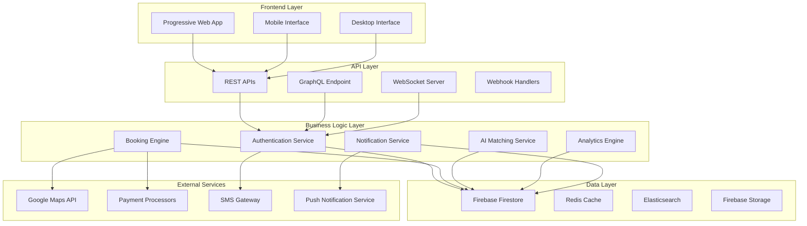

# GoCars Enhancement - Design Document

## Overview

This design document outlines the technical architecture and implementation approach for transforming the existing TaxiNow platform into GoCars - a modern, feature-rich taxi booking platform. The design preserves all existing functionality while adding significant enhancements to user experience, performance, and feature set.

## Architecture

### High-Level Architecture



### Technology Stack Enhancement

**Frontend Enhancements:**
- Next.js 14 with App Router (existing)
- Enhanced TypeScript with strict mode
- Tailwind CSS with custom design system
- ShadCN UI with custom components
- Framer Motion for animations
- React Query for state management
- PWA with service workers

**Backend Enhancements:**
- Firebase Functions for serverless computing
- WebSocket integration for real-time features
- GraphQL API alongside REST
- Redis for caching and session management
- Elasticsearch for advanced search

**Infrastructure:**
- Firebase Hosting with CDN
- Firebase Firestore with optimized indexes
- Firebase Storage for file management
- Monitoring with Firebase Analytics
- Error tracking with Sentry

## Components and Interfaces

### 1. Brand Identity System

**Logo and Branding:**
```typescript
interface BrandConfig {
  name: 'GoCars';
  tagline: 'Your Journey, Our Priority';
  colors: {
    primary: '#2563eb'; // Blue
    secondary: '#7c3aed'; // Purple
    accent: '#059669'; // Green
    warning: '#d97706'; // Orange
    danger: '#dc2626'; // Red
  };
  typography: {
    heading: 'Inter';
    body: 'Inter';
    mono: 'JetBrains Mono';
  };
}
```

**Component Library Enhancement:**
- Enhanced Button components with loading states and animations
- Advanced Card components with hover effects
- Interactive Form components with real-time validation
- Modern Navigation components with breadcrumbs
- Enhanced Modal and Dialog components

### 2. Enhanced Dashboard Components

**Dashboard Widget System:**
```typescript
interface DashboardWidget {
  id: string;
  type: 'metric' | 'chart' | 'list' | 'map' | 'action';
  title: string;
  data: any;
  config: WidgetConfig;
  permissions: string[];
  refreshInterval?: number;
}

interface WidgetConfig {
  size: 'small' | 'medium' | 'large';
  position: { x: number; y: number };
  customizable: boolean;
  exportable: boolean;
}
```

**Role-Specific Dashboards:**
- **Passenger Dashboard:** Quick booking, ride history, favorites, AI suggestions
- **Driver Dashboard:** Earnings tracker, ride requests, performance metrics, navigation
- **Operator Dashboard:** Fleet overview, driver management, analytics, dispatch control
- **Admin Dashboard:** System health, user management, business intelligence, reports

### 3. Real-time Communication System

**WebSocket Architecture:**
```typescript
interface WebSocketMessage {
  type: 'location_update' | 'ride_status' | 'chat_message' | 'notification';
  payload: any;
  timestamp: number;
  userId: string;
  roomId?: string;
}

class RealtimeService {
  private socket: WebSocket;
  private reconnectAttempts: number = 0;
  private maxReconnectAttempts: number = 5;
  
  connect(userId: string): void;
  subscribe(channel: string, callback: Function): void;
  unsubscribe(channel: string): void;
  send(message: WebSocketMessage): void;
  handleReconnection(): void;
}
```

**Enhanced Chat System:**
- Rich media support (images, location sharing)
- Message status indicators (sent, delivered, read)
- Quick reply templates
- Voice message support
- Chat history with search

### 4. Advanced Booking Engine

**Multi-Stop Booking System:**
```typescript
interface MultiStopBooking {
  id: string;
  passengerId: string;
  stops: BookingStop[];
  vehicleType: VehicleType;
  scheduledTime?: Date;
  recurring?: RecurringConfig;
  groupBooking?: GroupBookingConfig;
  preferences: BookingPreferences;
}

interface BookingStop {
  order: number;
  location: LocationPoint;
  estimatedArrival?: Date;
  actualArrival?: Date;
  waitTime?: number;
  instructions?: string;
}

interface RecurringConfig {
  frequency: 'daily' | 'weekly' | 'monthly';
  days?: number[]; // For weekly: 0-6 (Sun-Sat)
  endDate?: Date;
  exceptions?: Date[];
}
```

**Smart Matching Algorithm:**
```typescript
interface MatchingCriteria {
  location: LocationPoint;
  vehicleType: VehicleType;
  preferences: PassengerPreferences;
  urgency: 'immediate' | 'scheduled';
  groupSize: number;
}

interface DriverScore {
  driverId: string;
  score: number;
  factors: {
    distance: number;
    rating: number;
    availability: number;
    preferences: number;
    efficiency: number;
  };
}

class AIMatchingService {
  calculateDriverScores(criteria: MatchingCriteria): Promise<DriverScore[]>;
  optimizeRouting(booking: MultiStopBooking): Promise<OptimizedRoute>;
  predictDemand(location: LocationPoint, time: Date): Promise<DemandForecast>;
}
```

### 5. Enhanced Safety System

**Emergency Response System:**
```typescript
interface EmergencyAlert {
  id: string;
  type: 'sos' | 'route_deviation' | 'panic' | 'accident';
  userId: string;
  rideId: string;
  location: LocationPoint;
  timestamp: Date;
  status: 'active' | 'resolved' | 'false_alarm';
  responseTime?: number;
}

class SafetyService {
  triggerEmergencyAlert(type: string, context: any): Promise<void>;
  monitorRideProgress(rideId: string): void;
  detectRouteDeviation(rideId: string, currentLocation: LocationPoint): boolean;
  notifyEmergencyContacts(alert: EmergencyAlert): Promise<void>;
  contactEmergencyServices(alert: EmergencyAlert): Promise<void>;
}
```

**Safety Features:**
- One-tap SOS button with location sharing
- Automatic emergency contact notification
- Route deviation detection and alerts
- Driver verification and background checks
- Ride sharing with trusted contacts
- Safe arrival confirmations

### 6. Business Intelligence Dashboard

**Analytics Engine:**
```typescript
interface AnalyticsMetric {
  id: string;
  name: string;
  value: number;
  change: number;
  period: 'hour' | 'day' | 'week' | 'month';
  trend: 'up' | 'down' | 'stable';
  target?: number;
}

interface ReportConfig {
  type: 'revenue' | 'usage' | 'performance' | 'satisfaction';
  dateRange: DateRange;
  filters: Record<string, any>;
  format: 'pdf' | 'excel' | 'csv' | 'json';
  schedule?: ScheduleConfig;
}

class AnalyticsService {
  generateReport(config: ReportConfig): Promise<Report>;
  getMetrics(period: string, filters: any): Promise<AnalyticsMetric[]>;
  predictTrends(metric: string, period: string): Promise<TrendForecast>;
  detectAnomalies(data: number[]): Promise<Anomaly[]>;
}
```

## Data Models

### Enhanced User Models

```typescript
interface GoCarsUser extends User {
  preferences: UserPreferences;
  safetySettings: SafetySettings;
  notificationSettings: NotificationSettings;
  paymentMethods: PaymentMethod[];
  emergencyContacts: EmergencyContact[];
  favoriteLocations: FavoriteLocation[];
  rideHistory: RideHistorySummary;
  loyaltyPoints: number;
  subscriptions: Subscription[];
}

interface UserPreferences {
  vehicleType: VehicleType[];
  temperature: number;
  music: boolean;
  conversation: 'minimal' | 'friendly' | 'chatty';
  petFriendly: boolean;
  accessibility: AccessibilityNeeds;
  language: string;
  currency: string;
}

interface SafetySettings {
  shareLocationWithContacts: boolean;
  autoEmergencyAlert: boolean;
  trustedContacts: string[];
  safeArrivalNotifications: boolean;
  rideVerificationRequired: boolean;
}
```

### Enhanced Booking Models

```typescript
interface GoCarsBooking extends Booking {
  type: 'immediate' | 'scheduled' | 'recurring' | 'group';
  stops: BookingStop[];
  groupMembers?: GroupMember[];
  recurringConfig?: RecurringConfig;
  preferences: BookingPreferences;
  safetyFeatures: SafetyFeature[];
  paymentSplit?: PaymentSplit[];
  carbonOffset?: CarbonOffsetInfo;
  accessibility?: AccessibilityRequirements;
}

interface BookingPreferences {
  vehicleType: VehicleType;
  driverGender?: 'male' | 'female' | 'any';
  temperature?: number;
  music?: boolean;
  conversation?: 'minimal' | 'friendly' | 'chatty';
  petFriendly?: boolean;
  childSeat?: boolean;
  wheelchairAccessible?: boolean;
}
```

## Error Handling

### Enhanced Error Management

```typescript
interface GoCarsError {
  code: string;
  message: string;
  details?: any;
  timestamp: Date;
  userId?: string;
  context?: ErrorContext;
  severity: 'low' | 'medium' | 'high' | 'critical';
}

interface ErrorContext {
  component: string;
  action: string;
  userAgent: string;
  url: string;
  stackTrace?: string;
}

class ErrorHandler {
  logError(error: GoCarsError): void;
  reportToSentry(error: GoCarsError): void;
  notifyAdmins(error: GoCarsError): void;
  showUserFriendlyMessage(error: GoCarsError): string;
  suggestRecoveryActions(error: GoCarsError): RecoveryAction[];
}
```

**Error Recovery Strategies:**
- Automatic retry mechanisms for transient failures
- Graceful degradation for non-critical features
- Offline mode with data synchronization
- User-friendly error messages with suggested actions
- Comprehensive error logging and monitoring

## Testing Strategy

### Comprehensive Testing Approach

**Unit Testing:**
- Jest for component and utility testing
- React Testing Library for component integration
- 90%+ code coverage requirement
- Automated test generation for API endpoints

**Integration Testing:**
- End-to-end testing with Playwright
- API integration testing
- Database integration testing
- Third-party service integration testing

**Performance Testing:**
- Load testing with Artillery
- Stress testing for peak usage scenarios
- Performance monitoring with Lighthouse
- Real user monitoring (RUM)

**Security Testing:**
- Automated security scanning
- Penetration testing
- OWASP compliance verification
- Data privacy audit

**Accessibility Testing:**
- Automated accessibility testing with axe-core
- Manual testing with screen readers
- WCAG 2.1 AA compliance verification
- User testing with accessibility needs

## Performance Optimization

### Frontend Optimization

**Code Splitting and Lazy Loading:**
```typescript
// Route-based code splitting
const PassengerDashboard = lazy(() => import('./pages/PassengerDashboard'));
const DriverDashboard = lazy(() => import('./pages/DriverDashboard'));

// Component-level lazy loading
const HeavyChart = lazy(() => import('./components/HeavyChart'));

// Dynamic imports for features
const loadAdvancedFeatures = () => import('./features/advanced');
```

**Caching Strategy:**
- Service Worker for offline functionality
- Redis for API response caching
- Browser caching for static assets
- CDN for global content delivery

**Bundle Optimization:**
- Tree shaking for unused code elimination
- Code compression and minification
- Image optimization with next/image
- Font optimization and preloading

### Backend Optimization

**Database Optimization:**
- Firestore composite indexes for complex queries
- Query optimization and result caching
- Connection pooling for external services
- Data denormalization for read-heavy operations

**API Optimization:**
- GraphQL for efficient data fetching
- Request batching and deduplication
- Rate limiting and throttling
- Response compression

## Security Enhancements

### Authentication and Authorization

**Enhanced Security Measures:**
- Multi-factor authentication (MFA)
- Biometric authentication support
- JWT token refresh mechanisms
- Role-based access control (RBAC)
- API key management for external integrations

**Data Protection:**
- End-to-end encryption for sensitive data
- PII data anonymization
- GDPR compliance features
- Data retention policies
- Secure file upload and storage

**Security Monitoring:**
- Real-time threat detection
- Automated security alerts
- Audit logging for all actions
- Regular security assessments
- Incident response procedures

## Deployment and Infrastructure

### CI/CD Pipeline

**Automated Deployment:**
```yaml
# GitHub Actions workflow
name: GoCars Deployment
on:
  push:
    branches: [main, develop]
  pull_request:
    branches: [main]

jobs:
  test:
    runs-on: ubuntu-latest
    steps:
      - uses: actions/checkout@v3
      - name: Setup Node.js
        uses: actions/setup-node@v3
      - name: Install dependencies
        run: npm ci
      - name: Run tests
        run: npm run test:ci
      - name: Run type check
        run: npm run typecheck
      - name: Run linting
        run: npm run lint
      
  build:
    needs: test
    runs-on: ubuntu-latest
    steps:
      - name: Build application
        run: npm run build
      - name: Deploy to Firebase
        run: firebase deploy
```

**Environment Management:**
- Development, staging, and production environments
- Feature flags for gradual rollouts
- Blue-green deployment strategy
- Automated rollback procedures
- Environment-specific configurations

### Monitoring and Observability

**Comprehensive Monitoring:**
- Application performance monitoring (APM)
- Real user monitoring (RUM)
- Error tracking and alerting
- Business metrics tracking
- Infrastructure monitoring

**Alerting System:**
- Real-time alerts for critical issues
- Escalation procedures for incidents
- Performance threshold monitoring
- Business metric anomaly detection
- Automated incident response

This design provides a comprehensive foundation for transforming TaxiNow into GoCars while maintaining all existing functionality and adding significant enhancements to create a modern, scalable, and feature-rich taxi booking platform.