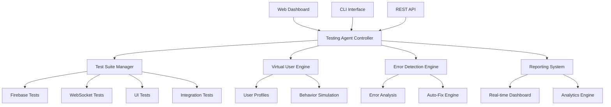

# GoCars Testing Agent Documentation

Welcome to the comprehensive documentation for the GoCars Testing Agent - an intelligent, automated testing system designed to validate all features of the GoCars taxi booking platform.

## 📚 Documentation Structure

### Getting Started
- [Quick Start Guide](./getting-started/quick-start.md) - Get up and running in minutes
- [Installation Guide](./getting-started/installation.md) - Detailed installation instructions
- [Configuration Guide](./getting-started/configuration.md) - System configuration and setup

### User Guides
- [Web Dashboard Guide](./user-guides/web-dashboard.md) - Using the web-based management interface
- [CLI Guide](./user-guides/cli-guide.md) - Command-line interface usage
- [Test Configuration Guide](./user-guides/test-configuration.md) - Creating and managing test configurations
- [Virtual Users Guide](./user-guides/virtual-users.md) - Managing virtual user profiles

### Developer Documentation
- [API Reference](./api/README.md) - Complete API documentation
- [Architecture Overview](./developer/architecture.md) - System architecture and design
- [Extension Guide](./developer/extensions.md) - Creating custom test suites and extensions
- [Contributing Guide](./developer/contributing.md) - How to contribute to the project

### Test Suites
- [Firebase Testing](./test-suites/firebase.md) - Firebase authentication and database testing
- [WebSocket Testing](./test-suites/websocket.md) - Real-time communication testing
- [UI Component Testing](./test-suites/ui-components.md) - User interface testing
- [Integration Testing](./test-suites/integration.md) - End-to-end workflow testing
- [Performance Testing](./test-suites/performance.md) - Load and performance testing

### Operations
- [Deployment Guide](./operations/deployment.md) - Production deployment instructions
- [Monitoring Guide](./operations/monitoring.md) - System monitoring and alerting
- [Troubleshooting Guide](./operations/troubleshooting.md) - Common issues and solutions
- [Maintenance Guide](./operations/maintenance.md) - System maintenance procedures

### Reference
- [Configuration Reference](./reference/configuration.md) - Complete configuration options
- [Error Codes](./reference/error-codes.md) - Error codes and their meanings
- [Glossary](./reference/glossary.md) - Terms and definitions
- [FAQ](./reference/faq.md) - Frequently asked questions

## 🚀 Quick Links

### For New Users
1. [Installation Guide](./getting-started/installation.md) - Install the testing agent
2. [Quick Start Guide](./getting-started/quick-start.md) - Run your first test
3. [Web Dashboard Guide](./user-guides/web-dashboard.md) - Use the web interface

### For Developers
1. [Architecture Overview](./developer/architecture.md) - Understand the system
2. [API Reference](./api/README.md) - Integrate with the testing agent
3. [Extension Guide](./developer/extensions.md) - Create custom test suites

### For Operations Teams
1. [Deployment Guide](./operations/deployment.md) - Deploy to production
2. [Monitoring Guide](./operations/monitoring.md) - Monitor system health
3. [Troubleshooting Guide](./operations/troubleshooting.md) - Resolve issues

## 🎯 What is the GoCars Testing Agent?

The GoCars Testing Agent is a comprehensive, intelligent testing system that:

- **Automates Testing**: Runs complete test suites automatically
- **Simulates Real Users**: Creates realistic user interactions and behaviors
- **Detects Issues**: Identifies problems across all system components
- **Provides Insights**: Generates detailed reports and analytics
- **Self-Heals**: Automatically fixes common issues when possible

### Key Features

#### 🤖 **Intelligent Testing**
- AI-powered test generation and execution
- Realistic user behavior simulation
- Adaptive testing strategies based on results

#### 🌐 **Comprehensive Coverage**
- Firebase authentication and database testing
- Real-time WebSocket communication testing
- UI component and user interaction testing
- End-to-end workflow validation
- Performance and load testing

#### 📊 **Advanced Reporting**
- Real-time monitoring dashboards
- Detailed test reports with analytics
- Performance metrics and trends
- Executive summaries and technical details

#### 🔧 **Easy Management**
- Web-based management interface
- Command-line tools for automation
- RESTful API for integration
- Flexible configuration options

#### 🚀 **Production Ready**
- Containerized deployment
- Auto-scaling capabilities
- Comprehensive monitoring
- High availability design

## 🏗️ System Architecture

## 📋 Prerequisites

### System Requirements
- **Node.js**: Version 18.0 or higher
- **Memory**: Minimum 4GB RAM (8GB recommended)
- **Storage**: 10GB available disk space
- **Network**: Internet connection for external service testing

### Dependencies
- **Firebase**: For authentication and database testing
- **WebSocket Server**: For real-time communication testing
- **Docker** (optional): For containerized deployment
- **Kubernetes** (optional): For orchestrated deployment

## 🎯 Use Cases

### Development Teams
- **Continuous Testing**: Integrate with CI/CD pipelines
- **Regression Testing**: Automatically detect regressions
- **Performance Monitoring**: Track performance over time
- **Quality Assurance**: Ensure code quality before deployment

### QA Teams
- **Manual Test Automation**: Automate repetitive manual tests
- **Exploratory Testing**: Generate test scenarios automatically
- **Bug Reproduction**: Reproduce and analyze bugs systematically
- **Test Coverage**: Ensure comprehensive test coverage

### Operations Teams
- **Production Monitoring**: Monitor live system health
- **Performance Testing**: Validate system performance
- **Capacity Planning**: Understand system limits
- **Incident Response**: Quickly identify and resolve issues

### Business Teams
- **Quality Metrics**: Track quality metrics over time
- **Release Confidence**: Gain confidence in releases
- **User Experience**: Ensure optimal user experience
- **Risk Management**: Identify and mitigate risks

## 🔗 Related Resources

### External Documentation
- [Firebase Documentation](https://firebase.google.com/docs)
- [WebSocket API Documentation](https://developer.mozilla.org/en-US/docs/Web/API/WebSockets_API)
- [Docker Documentation](https://docs.docker.com/)
- [Kubernetes Documentation](https://kubernetes.io/docs/)

### Community
- [GitHub Repository](https://github.com/Saanwar2002/Gocars)
- [Issue Tracker](https://github.com/Saanwar2002/Gocars/issues)
- [Discussions](https://github.com/Saanwar2002/Gocars/discussions)

### Support
- [Troubleshooting Guide](./operations/troubleshooting.md)
- [FAQ](./reference/faq.md)
- [Contact Support](mailto:support@gocars.com)

---

## 📄 License

This project is licensed under the MIT License - see the [LICENSE](../LICENSE) file for details.

## 🤝 Contributing

We welcome contributions! Please see our [Contributing Guide](./developer/contributing.md) for details on how to get started.

---

*Last updated: January 2024*